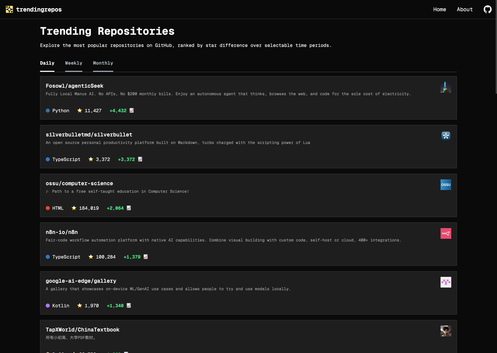
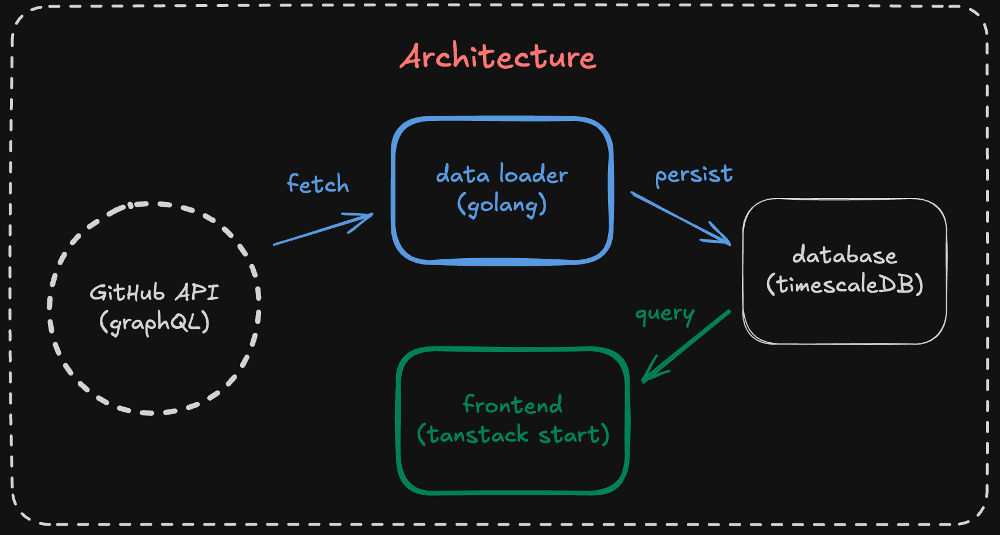

# trendingrepos

    

[trendingrepos](https://trendingrepos.glup3.dev), explore the most popular
repositories on GitHub, ranked by star difference over selectable time periods.
The GitHub Trending page was not enough, so I built my own.

## How does it work?

The data is fetched hourly from the official GitHub API by my custom built data
loader written in Go. The database in use is TimescaleDB, I aggregate the data
in dayly buckets and calculate the star difference for the time periods. In
order to achieve less than 100ms query times, I store the end result in
materialized views, which are updated hourly. The frontend is using
Tanstack Start + Tailwindcss, very basic.

I am using the GitHub graphql "Search" endpoint to fetch all the repositories
ordered by stars descending. In order to overcome the maximum of 1000 search
results limitation, I decrease my star range query every 1000 repos.

Example: "stars:200..500000" --> "stars:200..100000" --> "stars:200..20000" --> ...

Around 240k repositories are fetched in 21 minutes. I found some little tricks
to speed up the fetching like for example, fetching all 10 pages
(100 pageSize \* 10 == 1000 results) at once, prefetching the next star ranges,
or making 200 requests at once and bypassing the secondary limit somehow.

# Architecture

    

## Feedback

Got suggestions, feature requests, or found a bug? Feel free to open an issue
on GitHub! Your feedback is greatly appreciated and helps improve the project.

👉 [Submit Feedback or Report an Issue](https://github.com/Glup3/trendingrepos/issues)

## License

[MIT](./LICENSE.md)
